# local_LLM_workspace
Running a 4B LLM fully offline on 16 GB RAM using Ollama + Docker + Open WebUI, with CPU-only inference benchmarked across 7 real study tasks.


## Why I Built This

So I started asking: Which model can actually be useful for this? Not just run and eat my RAM. Can I actually study with it? Debug with it? Understand complex concepts such as transformers with it?

Instead of assuming yes or no, I measured it. I started with Qwen3:8B, but it took too long to download, so I switched to Qwen3.5:4B and I don't regret it.

---

## What I Set Up

```
Windows 11
│
├── Ollama (Port 11434) ──── Qwen3.5:4B (CPU-only, 0% GPU compute)
│
└── Docker Desktop + WSL2
         └── Open WebUI (Port 3000)
                  └── connects to Ollama on host
```
<p align="center"> 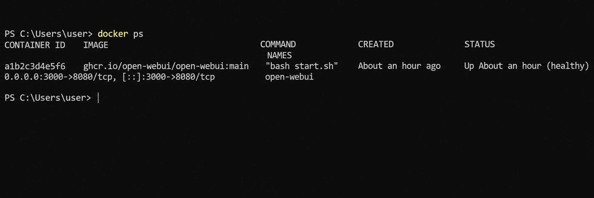 </p>

Inference path: `You → Open WebUI → Ollama → Qwen3.5:4B → CPU → Response`

No internet required after this setup, without any API key and no data leaving the machine.

---

## Hardware

| | |
|---|---|
| CPU | AMD Ryzen 7 7735HS (8 cores / 16 logical processors) |
| RAM | 16 GB (usable ~14.8 GB) |
| GPU | Integrated AMD Radeon — **0% compute during inference** |
| OS | Windows 11 + Docker Desktop + WSL2 |

<p align="center">
  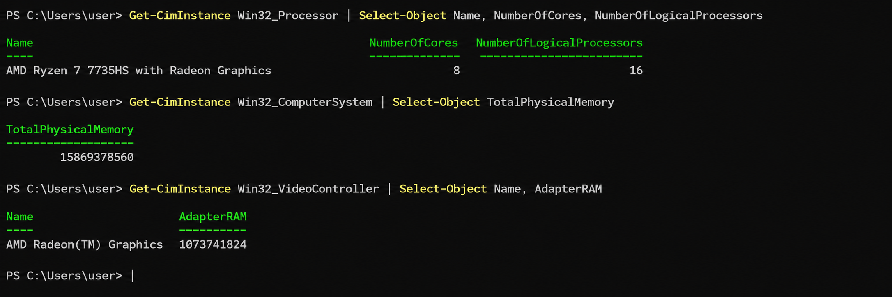
</p>

---

## Model

**Qwen3.5:4B** via Ollama

| | |
|---|---|
| Disk | ~3.4 GB |
| RAM when loaded (idle) | ~12.8 GB (~86%) |
| RAM during active inference | ~13–14 GB (85–88%) |
| Inference device | CPU only |

<p align="center">
  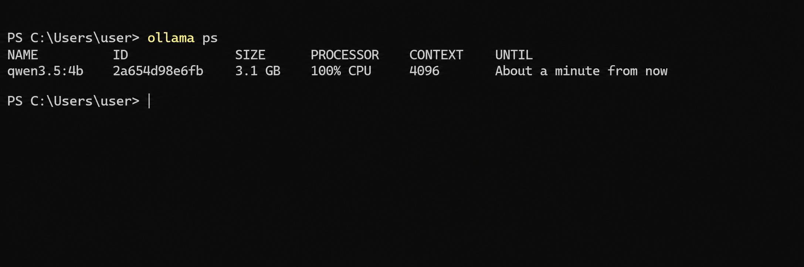
</p>

---

## The Most Interesting Finding

<p align="center">
  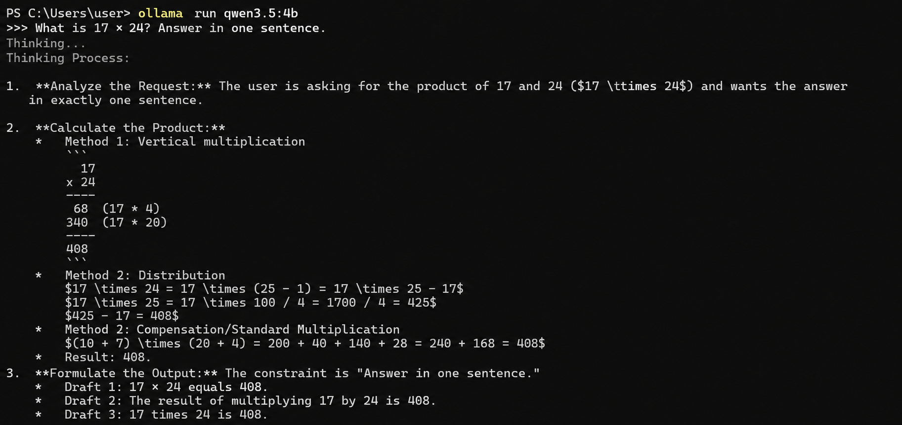
  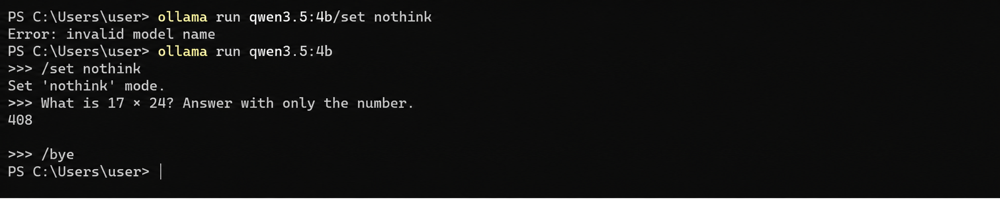
</p>

I expected thinking mode ON to be slower because the model would do more reasoning. What surprised me was how large the difference became on my CPU-only setup.

With thinking OFF, simple study tasks completed in minutes. With thinking-ON, one controlled API test took **~100 minutes** to complete.

The important lesson was that thinking mode isn't simply "the same answer at a slightly slower token rate." The model can perform substantially more internal computation before producing its final answer.

On a CPU-only 16 GB laptop, that extra reasoning can make extended thinking impractical for routine study tasks.

For this workspace, I therefore use **thinking OFF as the default** and reserve thinking mode for problems where additional reasoning is actually worth the extra computation.

---

## Benchmark: 7 Practical Tasks, Fully Offline

Wi-Fi disconnected. `Test-NetConnection 1.1.1.1` returned `False`. Thinking OFF.

| # | What I tested | Time |
|---|--------------|------|
| 1 | Python dictionaries — concept explanation | 1m 56s |
| 2 | Write `find_duplicates()` function | 1m 19s |
| 3 | Find and fix a loop mutation bug | 1m 38s |
| 4 | Explain self-attention: Q, K, V, softmax, weighted sum | 2m 31s |
| 5 | Tensor shape (32, 128, 768) — dimensions and linear layer math | 1m 40s |
| 6 | Summarize a Transformer passage in 6 bullet points | 1m 08s |
| 7 | Teach softmax with intuition, formula, example, quiz | 4m 02s |

**Total: 14m 14s. Average: ~2m 02s per task.**

### Evidence

<p align="center">
  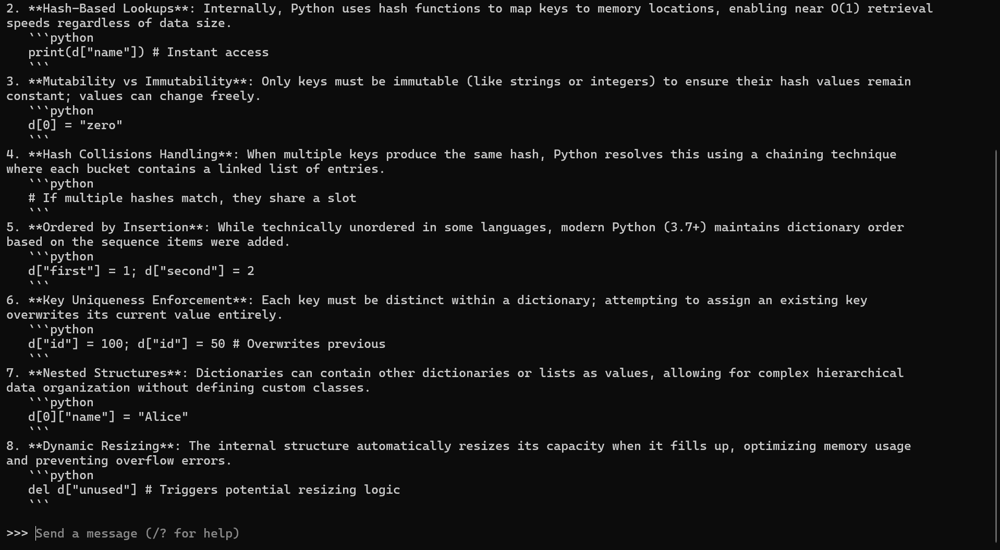
  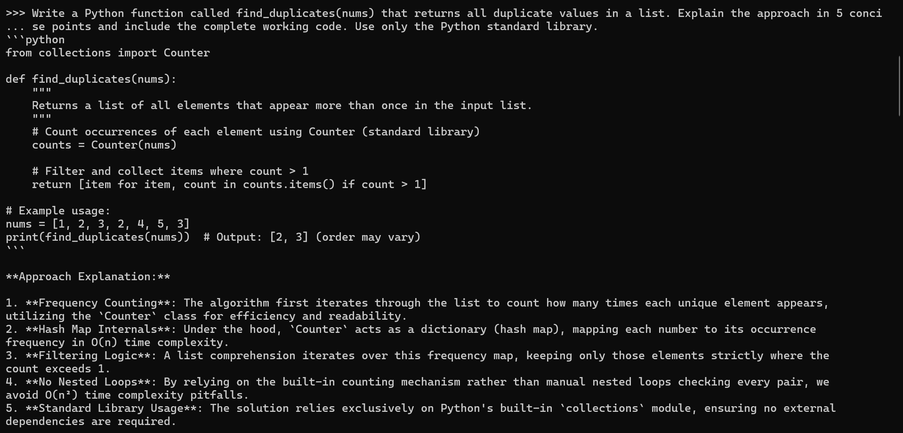
</p>

<p align="center">
  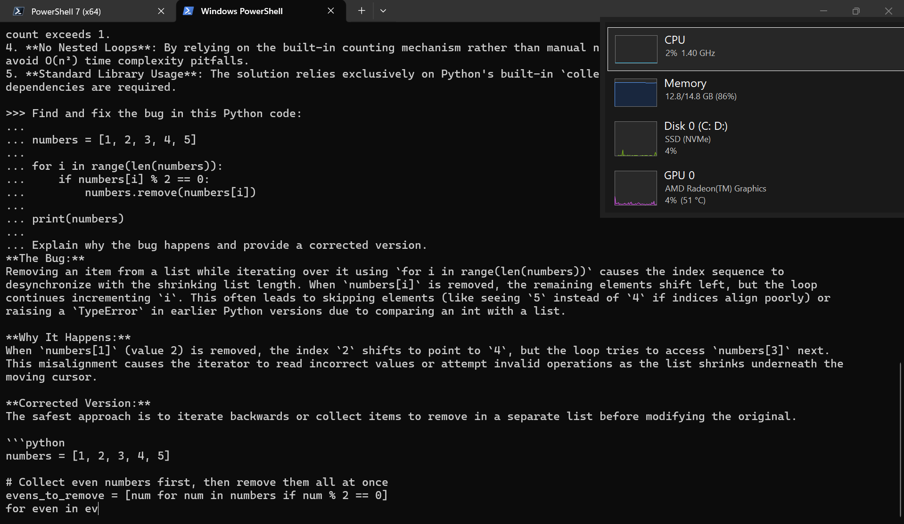
  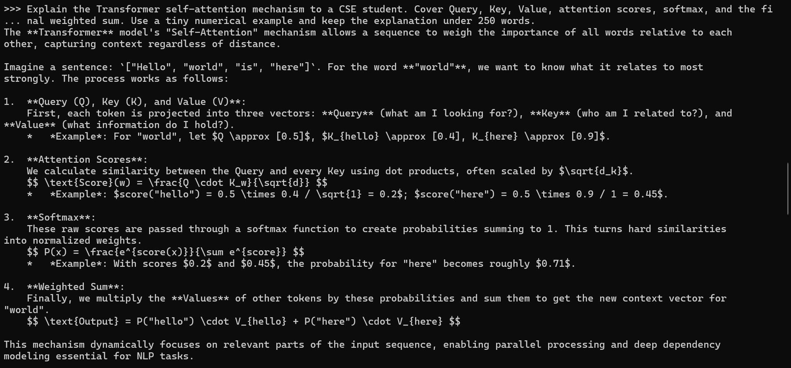
</p>

<p align="center">
  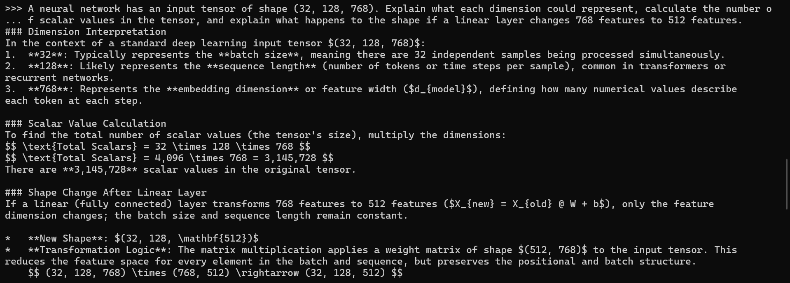
  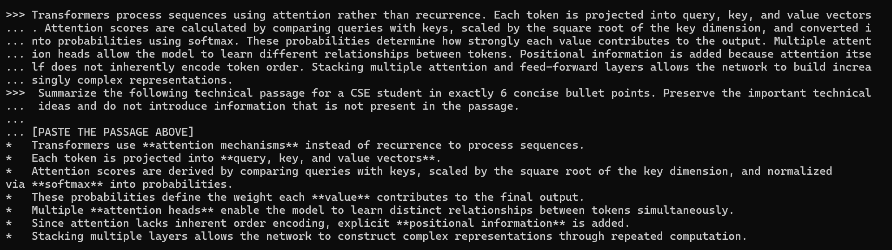
</p>

#### Softmax Study

<p align="center">
  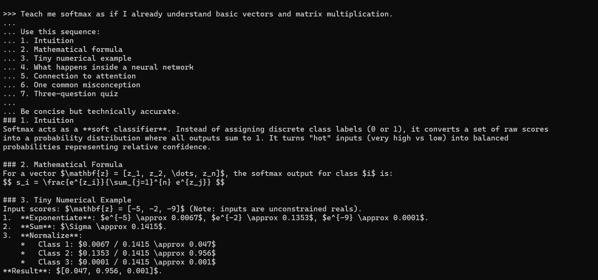
  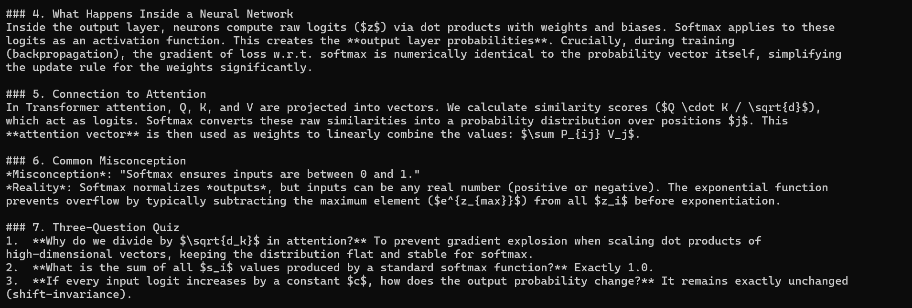
</p>

---

## Resource Usage

**During active inference:**
- CPU: ~72–75%
- RAM: ~85–88%
- GPU: ~2–3% (integrated, not doing compute)

<p align="center">
  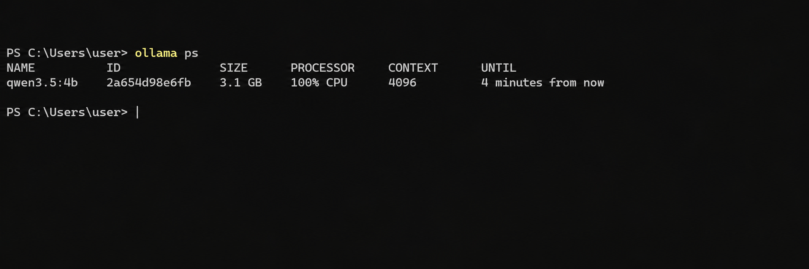
</p>

<p align="center">
  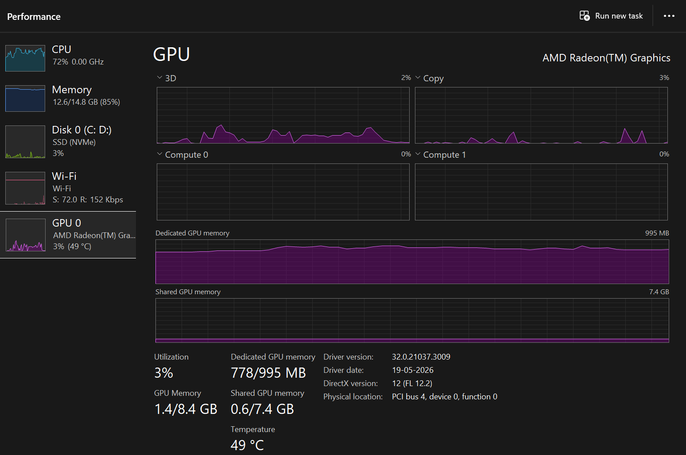
  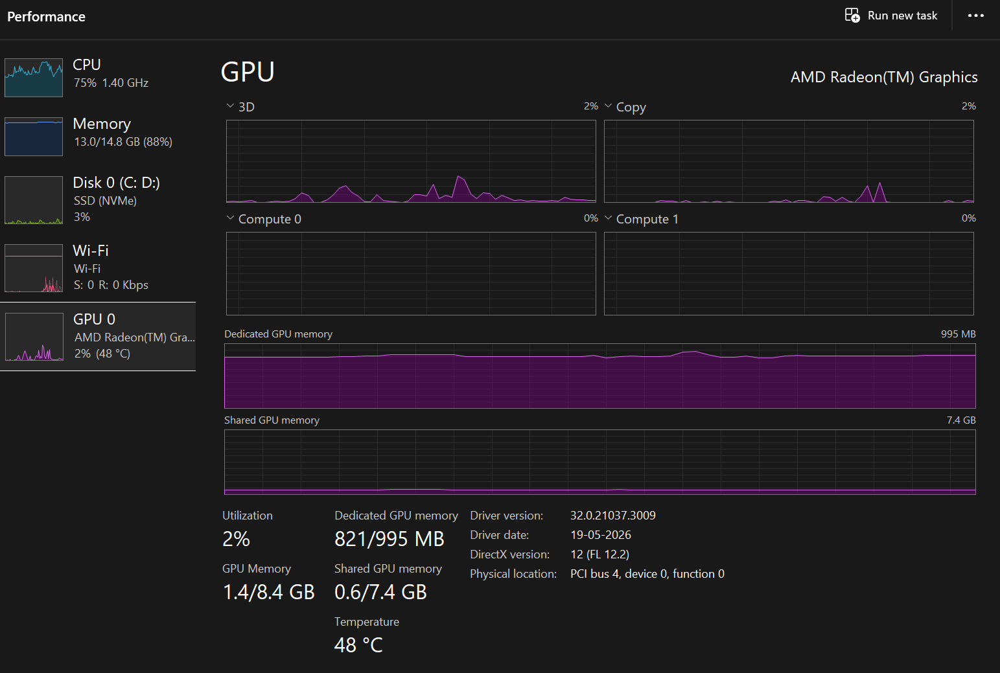
</p>

### Offline Verification

<p align="center">
  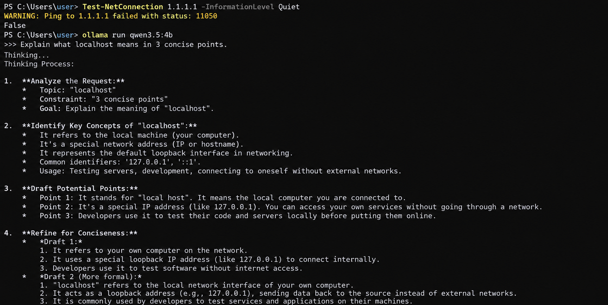
  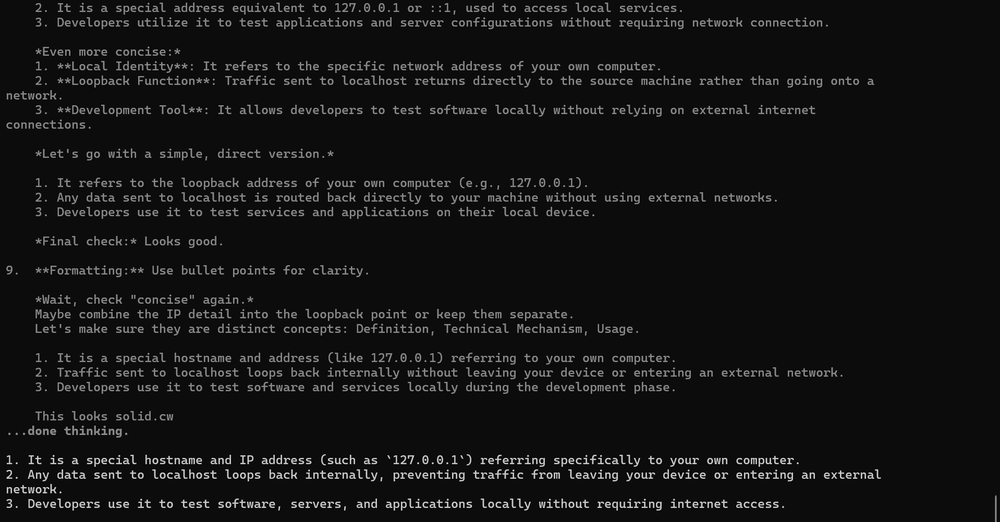
</p>

---

**After generation finishes:**
- CPU drops back to ~2%
- RAM stays high — model stays loaded

You can't comfortably run heavy applications while it's generating. Browser + IDE + Ollama works. Anything heavier starts competing for RAM.


---

## What Failed (I'm Keeping This In)

**Terminal math notation** — weighted sum formulas, LaTeX-style equations don't render properly in a PowerShell terminal. Use Open WebUI for anything math-heavy.

**Truncated output** — the final test (RAM vs. VRAM, 5 points requested) stopped after 3. Small models on CPU will sometimes cut off long structured responses.

**Factual errors in generated answers:**
- Dictionary explanation oversimplified Python's hash collision handling (not accurate for modern CPython)
- Softmax explanation had an incorrect statement about gradient behavior

I'm not hiding these. This benchmark measures **whether the setup works for practical study**, not whether every answer is correct. Local LLMs still need verification — that's part of what I learned by actually using it.

---

## Real-World Study Test

The benchmark showed that the setup could handle individual tasks offline. I also tested the workflow through the actual Open WebUI interface rather than only through the terminal.

The test used a controlled prompt asking Qwen3.5:4B to explain Python dictionaries in 8 concise numbered points with examples and a word limit.

<p align="center">
  
</p>

The response was generated locally through Open WebUI → Ollama → Qwen3.5:4B, without requiring an internet connection.

---

## How to Reproduce This

### What you need
- Windows 11 with WSL2 enabled
- Docker Desktop (AMD64 version)
- At least 16 GB RAM

### Step 1 — Install Ollama

Download from [ollama.com](https://ollama.com) and install.

```powershell
# Pull the model (~3.4 GB — do this when you have decent internet)
ollama pull qwen3.5:4b

# Verify it works
ollama run qwen3.5:4b
# Type /bye to exit
```

### Step 2 — Install Docker Desktop

Download the AMD64 version from [docker.com](https://docker.com). Enable WSL2 integration during setup.

### Step 3 — Run Open WebUI

```powershell
docker run -d -p 3000:8080 `
  --add-host=host.docker.internal:host-gateway `
  -v open-webui:/app/backend/data `
  --name open-webui `
  --restart always `
  ghcr.io/open-webui/open-webui:main
```

Open `http://localhost:3000`. Create a local account. Qwen3.5:4B appears automatically.

### Step 4 — Test offline

```powershell
# Disconnect Wi-Fi, then:
Test-NetConnection 1.1.1.1 -InformationLevel Quiet
# Returns: False

# Ollama still works
ollama run qwen3.5:4b
```

### Controlling thinking mode

```
# Inside ollama run qwen3.5:4b

/set nothink    # faster — use this for study
/set think      # extended reasoning — much slower on CPU
```

---

## What I Actually Learned

The setup works on CPU-only hardware, and for my tested study tasks the average response time was ~2m 02s with thinking OFF.

The interesting finding wasn't a particular token-speed number. It was understanding why thinking mode became impractical on this hardware.

The limitations matter too. Terminal is the wrong interface for math. The model truncates occasionally. Factual errors appear. These aren't reasons to not use local LLMs — they're things to know going in.

The original problem is solved: I can study and debug without needing internet.

---


*Started because my evening internet was 200 KB/s and I needed to study anyway.*
